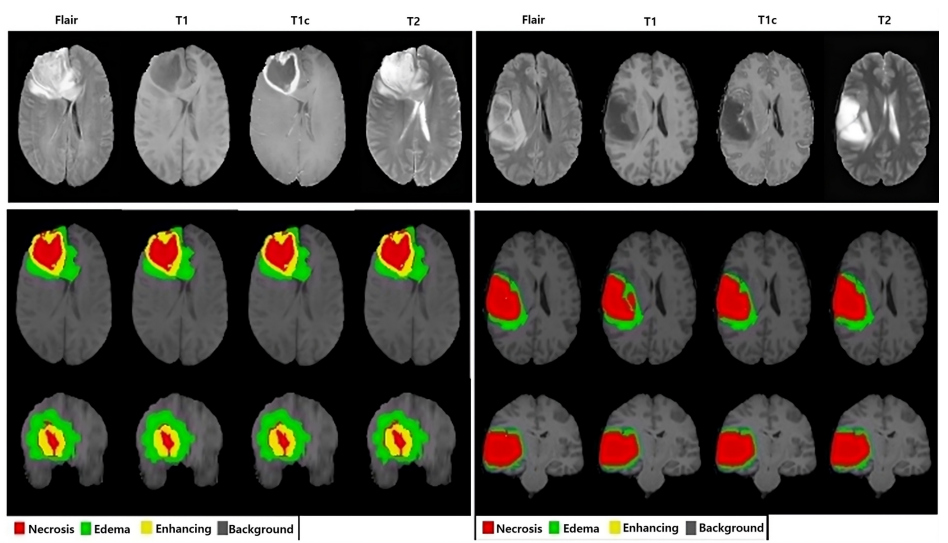
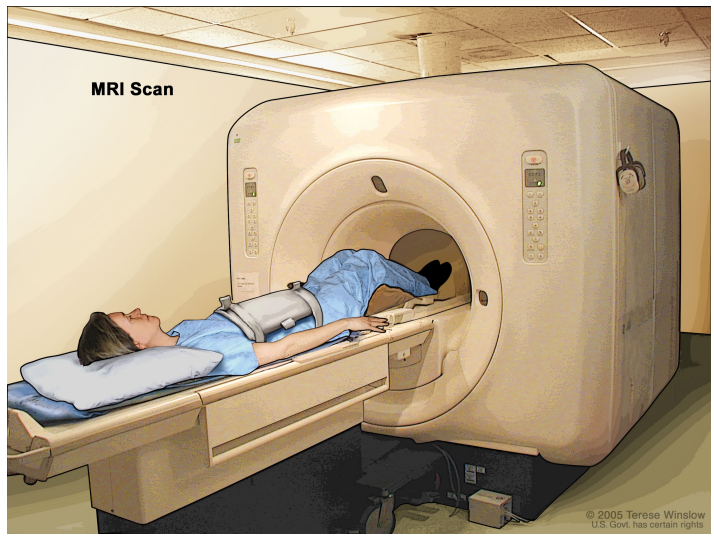
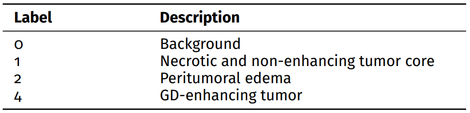
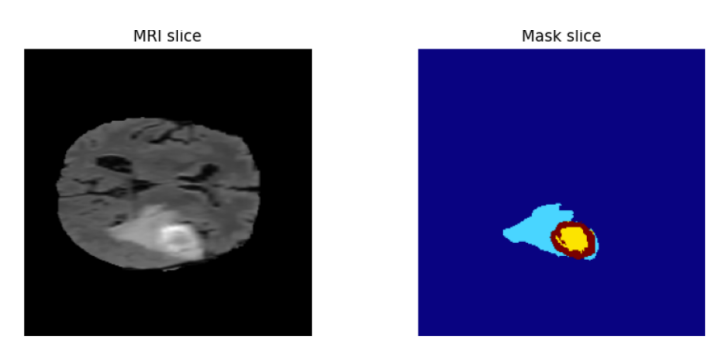
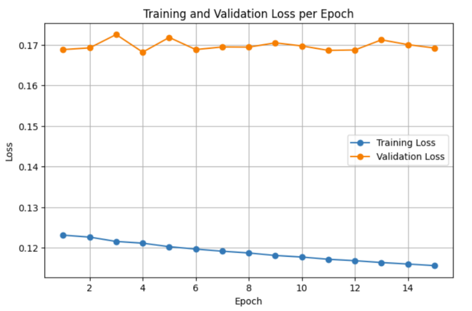
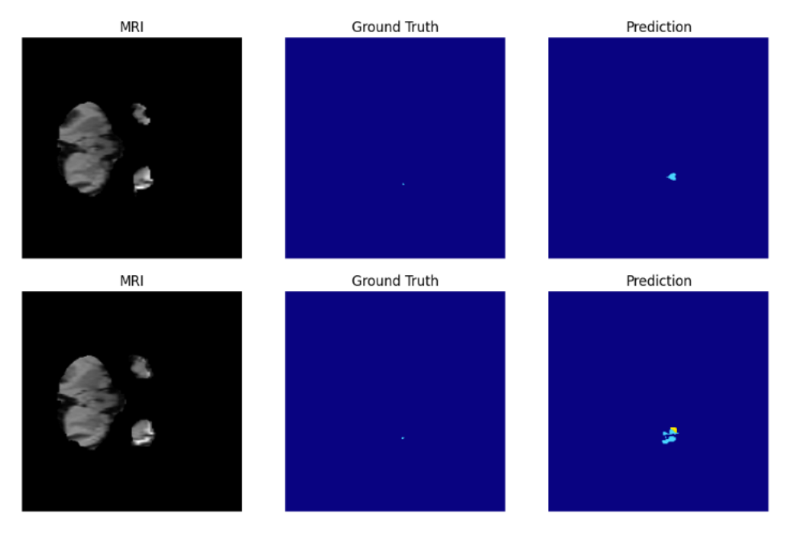
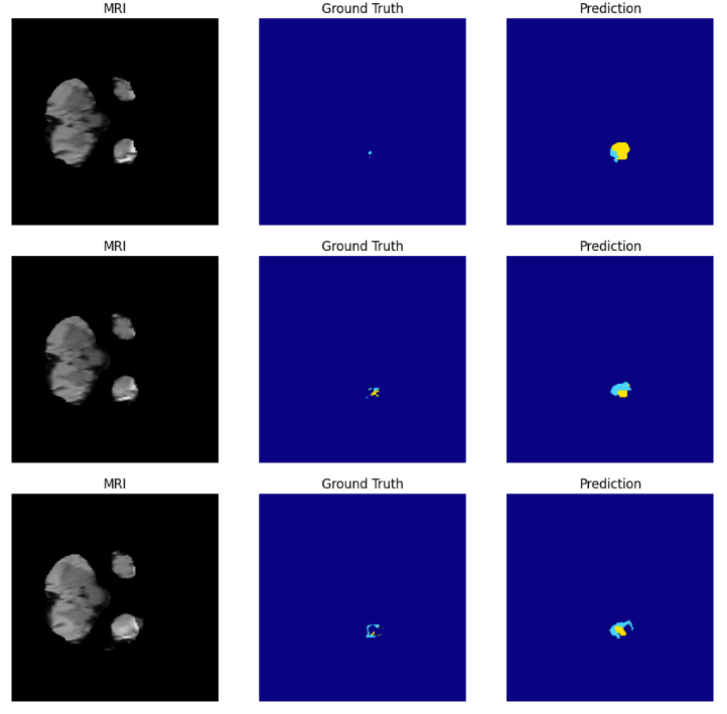
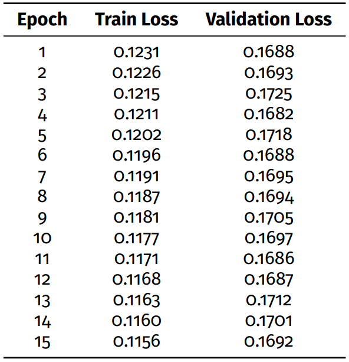
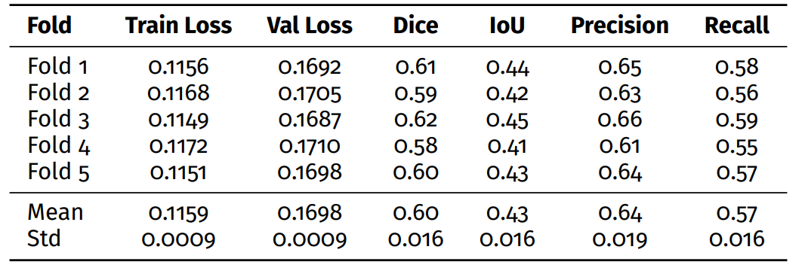

# 🧠 Deep Learning-based Brain Tumor Segmentation Using MRI

This project presents a deep learning pipeline for **brain tumor segmentation** using multi-modal MRI data from the **BraTS dataset**. A **2D U-Net model** was trained and evaluated using **5-fold cross-validation**, focusing on clinically relevant tumor regions described in the report.

## 🗂️ Dataset

The experiments were conducted using the **BraTS brain tumor dataset**, which provides voxel-wise annotations for different tumor subregions. The label convention used in this project is: 

 

For model development, only the training portion of the dataset was used, and a **5-fold cross-validation strategy** was applied.

## ⚙️ Methodology

### Preprocessing

The MRI volumes were processed **slice by slice** for 2D segmentation. Only slices containing relevant anatomical or tumor information were considered for training. Images were resized to **240 × 240**, and segmentation masks were converted into integer label maps for supervised learning

### Model Architecture

A **2D U-Net** architecture was used for the segmentation task. The model takes a single MRI slice as input and predicts a pixel-wise segmentation map. The encoder extracts high-level features through convolution and downsampling, while the decoder restores spatial resolution through upsampling and skip connections

### Training Setup

The model was trained using **5-fold cross-validation at the patient level**, ensuring that slices from the same patient did not appear in both training and validation subsets. The training configuration reported was:

- **Input size:** 240 × 240  
- **Batch size:** 4  
- **Number of folds:** 5  
- **Optimizer:** Adam  
- **Loss function:** Cross-entropy / Dice-based loss  
- **Number of epochs:** 15  

## 📊 Evaluation Metrics

The segmentation performance was evaluated using the following metrics:

- **Dice Score**
- **95% Hausdorff Distance (HD95)**
- **IoU**
- **Precision**
- **Recall**

The tumor regions evaluated were:

- **Enhancing Tumor (ET):** label 4  
- **Tumor Core (TC):** labels 1 and 4  
- **Whole Tumor (WT):** labels 1, 2, and 4  

## 📈 Results

